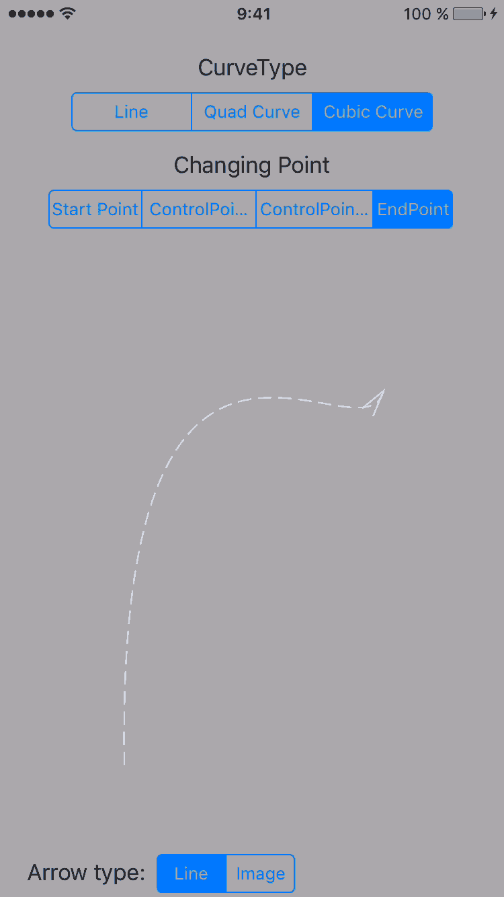

[](http://cocoapods.org/pods/AFCurvedArrowView)
[](https://github.com/anton-filimonov/AFCurvedArrowView/blob/master/LICENSE)
[](http://cocoapods.org/pods/AFCurvedArrowView)

# AFCurvedArrowView
A view to show a configurable arrow wherever you need. (Mostly useful for user guides) You don’t need to have different images for arrows for different screen sizes.

## Installation
* You can install it using cocoapods. Just add `pod 'AFCurvedArrowView'` to your Podfile and run `pod install`
* Or you can just copy files `AFCurvedArrowView.h` and `.m` to your project.

## Usage
Create AFCurvedArrowView, tweak it and add to your view like this:
```Objective-C
AFCurvedArrowView *arrowView = [[AFCurvedArrowView alloc] initWithFrame:CGRectMake(100.0, 100.0, 200.0, 200.0)];
arrowView.arrowHeadHeight = 20.0;
arrowView.arrowHeadWidth = 10.0;
arrowView.arrowTail = CGPointZero;
arrowView.arrowHead = CGPointMake(1.0, 0.7);
arrowView.controlPoint1 = CGPointMake(-0.3, 1.3);
arrowView.curveType = AFCurveTypeQuadratic;
[self.view addSubview:arrowView];
```

Or you can add it in your nibs or storyboards and tweak it’s IBInspectable properties.

## Screenshot
### iPhone



## License
The MIT License (MIT)
